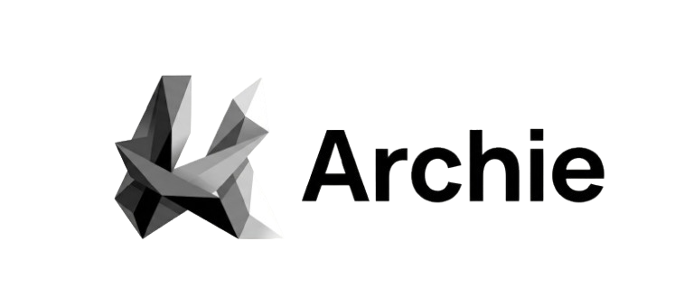
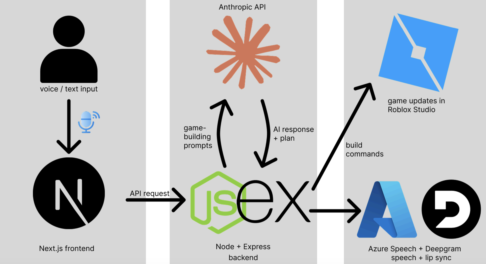

<p align="center">
  
</p>

<p align="center">
  A voice-enabled AI agent that helps kids build Roblox games through conversation.
</p>

---

## Architecture

<p align="center">
  
</p>

## How To Install And Run

1. Install dependencies:

```bash
cd frontend && npm install
```

2. Create a `frontend/.env` file with your API keys (see [Environment Variables](#environment-variables)).

3. Start the dev server:

```bash
cd frontend && npm run dev
```

4. Open `http://localhost:3000` in your browser.

5. Install the Roblox Studio plugin by dragging `plugin/ArchiePlugin.rbxm` into your Roblox plugins folder (`~/Documents/Roblox/Plugins/` on Mac).

## Setup

### Roblox Studio Security

The Archie plugin needs HTTP requests enabled to talk to the local server.

1. Open your place in Roblox Studio.
2. Go to `File > Game Settings > Security`.
3. Turn on `Allow HTTP Requests`.
4. Make sure the Archie frontend is running on `http://localhost:3000`.

For unpublished places, you can also enable it from the Command Bar:

```lua
game:GetService("HttpService").HttpEnabled = true
```

If `Allow HTTP Requests` is off, the plugin can't reach the server and the app will show `Studio Offline`.

### Environment Variables

Create `frontend/.env` with the following:

```bash
ANTHROPIC_API_KEY=your_anthropic_key
DEEPGRAM_API_KEY=your_deepgram_key
AZURE_SPEECH_KEY=your_azure_speech_key
AZURE_SPEECH_REGION=your_azure_region
AZURE_SPEECH_VOICE=en-US-GuyNeural
```

- `DEEPGRAM_API_KEY` — speech synthesis fallback and browser voice features.
- `AZURE_SPEECH_KEY` / `AZURE_SPEECH_REGION` — Azure speech synthesis with viseme support.
- `AZURE_SPEECH_VOICE` — optional, defaults to `en-US-GuyNeural`.
